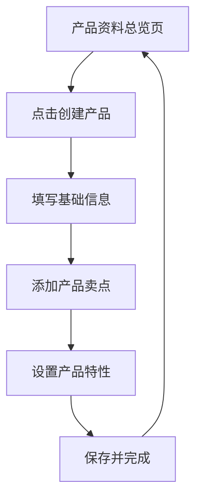
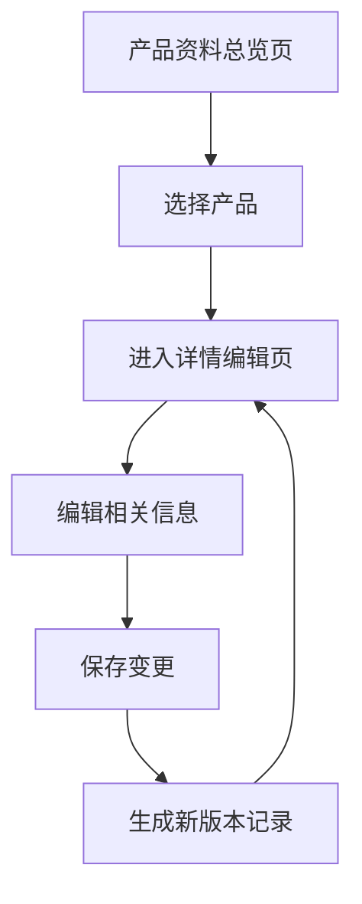
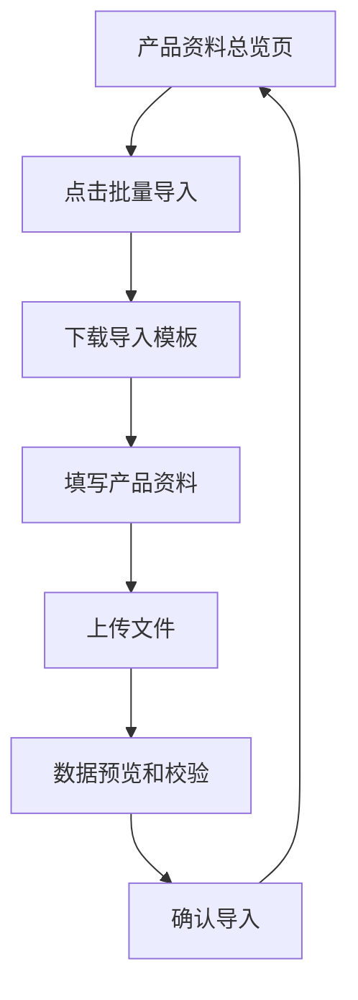

## 1. 产品概述

产品资料管理功能是产品鸭平台的核心基础模块，专注于产品基础信息、卖点、特性的系统化维护。作为独立的功能板块，它为内容规划、竞品分析等其他功能提供标准化的产品数据支撑。

主要解决以下问题：
- 产品信息分散、缺乏统一管理
- 产品卖点和特性描述不规范
- 内容创作时难以快速获取产品资料
- 产品版本迭代信息追踪困难

目标用户：产品经理、内容运营人员、品牌营销人员

## 2. 核心功能

### 2.1 用户角色
| 角色 | 注册方法 | 核心权限 |
|------|----------|----------|
| 产品管理员 | 系统自动分配（产品创建者） | 产品资料全权限管理 |
| 产品编辑者 | 管理员邀请或分配 | 产品信息编辑、更新 |
| 产品查看者 | 管理员邀请或分配 | 仅可查看产品资料 |

### 2.2 功能模块
产品资料管理包含以下核心页面：

1. **产品资料总览页**：产品列表、基础信息展示、快捷操作
2. **产品详情编辑页**：产品基础信息、卖点管理、特性维护
3. **产品版本管理页**：版本历史、变更记录、版本对比
4. **产品资料导入页**：批量导入、模板下载、数据校验

### 2.3 页面详情
| 页面名称 | 模块名称 | 功能描述 |
|----------|----------|----------|
| 产品资料总览页 | 产品列表 | 展示用户有权限的所有产品，支持搜索和筛选 |
| 产品资料总览页 | 快捷操作区 | 快速创建产品、批量操作、导入导出功能 |
| 产品资料总览页 | 产品统计 | 显示产品数量、完善度、最近更新等统计信息 |
| 产品详情编辑页 | 基础信息 | 编辑产品名称、描述、Logo、官网等基本信息 |
| 产品详情编辑页 | 产品卖点 | 管理产品核心卖点，支持排序和权重设置 |
| 产品详情编辑页 | 产品特性 | 维护产品功能特性，支持分类和标签管理 |
| 产品详情编辑页 | 版本信息 | 记录产品版本号、更新内容、发布时间 |
| 产品版本管理页 | 版本历史 | 展示产品所有历史版本和变更记录 |
| 产品版本管理页 | 版本对比 | 对比不同版本间的差异 |
| 产品资料导入页 | 模板下载 | 提供标准的产品资料导入模板 |
| 产品资料导入页 | 文件上传 | 支持Excel/CSV格式的产品资料批量导入 |
| 产品资料导入页 | 数据预览 | 预览导入数据，支持编辑和确认 |

## 3. 核心流程

### 3.1 产品资料创建流程


### 3.2 产品资料编辑流程


### 3.3 产品资料导入流程


## 4. 用户界面设计

### 4.1 设计风格
- **主色调**：延续产品鸭现有蓝色系（#3B82F6）
- **辅助色**：使用绿色（#10B981）表示成功状态，橙色（#F59E0B）表示警告
- **按钮样式**：圆角矩形，主要操作为实心填充，次要操作为边框样式
- **字体**：中文使用PingFang SC，英文使用Inter，保持与现有系统一致
- **布局风格**：卡片式布局，左侧导航+右侧内容区域的经典后台布局
- **图标风格**：使用Lucide React图标库，保持线条简洁风格

### 4.2 页面设计概述
| 页面名称 | 模块名称 | UI元素 |
|----------|----------|--------|
| 产品资料总览页 | 产品卡片 | 圆角卡片设计，包含产品Logo、名称、描述、更新时间 |
| 产品资料总览页 | 搜索栏 | 顶部搜索框，支持按产品名称和描述搜索 |
| 产品资料总览页 | 操作按钮 | 主要操作使用蓝色主按钮，次要操作使用灰色边框按钮 |
| 产品详情编辑页 | 信息表单 | 分组表单设计，每个模块使用独立卡片容器 |
| 产品详情编辑页 | 卖点管理 | 可拖拽排序的列表，支持添加、编辑、删除操作 |
| 产品详情编辑页 | 特性标签 | 标签云展示，支持多选和颜色标识 |
| 产品版本管理页 | 时间轴 | 垂直时间轴展示版本历史，高亮显示重要变更 |
| 产品资料导入页 | 文件上传 | 拖拽上传区域，支持点击选择和文件拖拽 |

### 4.3 响应式设计
- 桌面端优先设计，最小宽度1200px
- 平板端适配（768px-1199px）：侧边栏收缩，内容区域自适应
- 移动端（<768px）：暂不支持，后续版本考虑
- 触控优化：按钮和交互元素最小44px点击区域

## 5. 数据结构设计

### 5.1 产品基础信息表结构
```sql
-- 产品基础信息表（扩展现有products表）
ALTER TABLE products ADD COLUMN slogan VARCHAR(255); -- 产品口号
ALTER TABLE products ADD COLUMN target_user TEXT; -- 目标用户
ALTER TABLE products ADD COLUMN pricing_info VARCHAR(100); -- 定价信息
ALTER TABLE products ADD COLUMN current_version VARCHAR(50); -- 当前版本
ALTER TABLE products ADD COLUMN completion_rate INTEGER DEFAULT 0; -- 资料完善度
```

### 5.2 产品卖点表
```sql
CREATE TABLE product_selling_points (
    id INT PRIMARY KEY AUTO_INCREMENT,
    product_id INT NOT NULL,
    title VARCHAR(100) NOT NULL, -- 卖点标题
    description TEXT, -- 卖点描述
    priority INTEGER DEFAULT 1, -- 优先级
    is_active BOOLEAN DEFAULT TRUE, -- 是否启用
    created_at TIMESTAMP DEFAULT CURRENT_TIMESTAMP,
    updated_at TIMESTAMP DEFAULT CURRENT_TIMESTAMP ON UPDATE CURRENT_TIMESTAMP,
    FOREIGN KEY (product_id) REFERENCES products(id) ON DELETE CASCADE,
    INDEX idx_product_id (product_id),
    INDEX idx_priority (priority)
);
```

### 5.3 产品特性表
```sql
CREATE TABLE product_features (
    id INT PRIMARY KEY AUTO_INCREMENT,
    product_id INT NOT NULL,
    category VARCHAR(50) NOT NULL, -- 特性分类
    feature_name VARCHAR(100) NOT NULL, -- 特性名称
    description TEXT, -- 特性描述
    tags JSON, -- 特性标签
    is_core BOOLEAN DEFAULT FALSE, -- 是否核心特性
    created_at TIMESTAMP DEFAULT CURRENT_TIMESTAMP,
    updated_at TIMESTAMP DEFAULT CURRENT_TIMESTAMP ON UPDATE CURRENT_TIMESTAMP,
    FOREIGN KEY (product_id) REFERENCES products(id) ON DELETE CASCADE,
    INDEX idx_product_id (product_id),
    INDEX idx_category (category)
);
```

### 5.4 产品版本历史表
```sql
CREATE TABLE product_versions (
    id INT PRIMARY KEY AUTO_INCREMENT,
    product_id INT NOT NULL,
    version VARCHAR(50) NOT NULL, -- 版本号
    changelog TEXT, -- 更新内容
    release_date DATE, -- 发布日期
    created_by INT NOT NULL, -- 创建者
    created_at TIMESTAMP DEFAULT CURRENT_TIMESTAMP,
    FOREIGN KEY (product_id) REFERENCES products(id) ON DELETE CASCADE,
    FOREIGN KEY (created_by) REFERENCES users(id) ON DELETE CASCADE,
    INDEX idx_product_id (product_id),
    INDEX idx_version (version)
);
```

## 6. 与现有系统集成方案

### 6.1 与竞品管理集成
- 在竞品详情页显示当前产品的核心卖点对比
- 支持基于产品特性进行竞品功能对比分析
- 产品资料变更时，同步更新相关竞品的对比数据

### 6.2 与内容规划集成
- 内容创作时可快速引用产品卖点和特性
- 支持基于产品特性自动生成内容主题建议
- 产品资料更新时，提醒相关内容的更新需求

### 6.3 与团队协作集成
- 产品资料权限与现有团队角色体系对接
- 产品资料变更记录显示操作者和时间
- 支持产品资料的审核和发布流程

## 7. 性能与安全要求

### 7.1 性能指标
- 产品列表页面加载时间 < 2秒
- 产品详情编辑保存响应时间 < 1秒
- 批量导入100条产品数据 < 5秒
- 支持最大产品卖点数量：50个
- 支持最大产品特性数量：200个

### 7.2 安全要求
- 产品资料操作需要权限验证
- 敏感信息（如定价）需要额外权限控制
- 批量导入文件需要进行病毒扫描
- 支持产品资料的历史版本恢复
- 定期备份产品资料数据

## 8. 扩展性设计

### 8.1 功能扩展
- 支持产品资料的多语言版本
- 支持产品图片和视频素材管理
- 支持产品资料的API接口开放
- 支持与其他营销工具的集成

### 8.2 数据扩展
- 产品资料结构支持自定义字段
- 支持产品分类和标签体系的扩展
- 支持产品关系的定义（如产品线、子产品）
- 支持产品资料的导入导出格式扩展