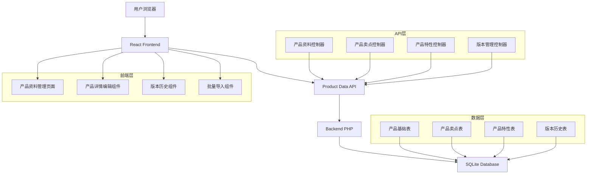
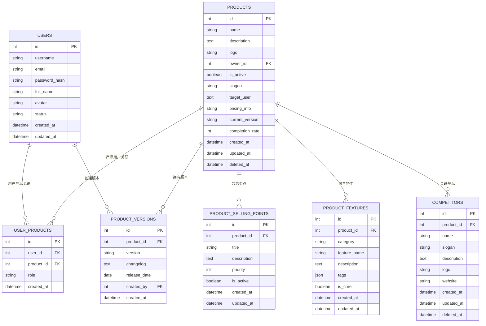

## 1. 架构设计

### 1.1 整体架构


### 1.2 系统架构说明
本方案基于现有产品鸭系统的PHP+SQLite架构进行扩展，保持技术栈一致性：
- **前端**：React 18 + Vite + Tailwind CSS
- **后端**：PHP 8.1 + 自定义MVC框架
- **数据库**：SQLite 3（扩展现有数据库结构）
- **文件存储**：本地文件系统（产品Logo等素材）

## 2. 技术栈描述

### 2.1 前端技术
- **React 18**：组件化开发，支持Hooks和并发特性
- **Vite 4**：快速构建工具，支持热更新
- **Tailwind CSS 3**：实用优先的CSS框架
- **Lucide React**：图标库，保持界面一致性
- **React Hook Form**：表单状态管理和验证
- **React Query**：服务端状态管理和缓存

### 2.2 后端技术
- **PHP 8.1**：面向对象编程，支持现代PHP特性
- **PDO**：数据库抽象层，支持多种数据库
- **JWT**：用户认证和权限控制
- **Respect/Validation**：数据验证库
- **Guzzle HTTP**：HTTP客户端（用于外部API调用）

### 2.3 数据库技术
- **SQLite 3**：轻量级嵌入式数据库
- **JSON字段**：存储结构化数据（特性标签等）
- **索引优化**：关键字段建立索引提升查询性能
- **事务支持**：确保数据一致性和完整性

## 3. 路由定义

### 3.1 前端路由
| 路由路径 | 组件 | 描述 |
|----------|------|------|
| `/products` | ProductDataManagementPage | 产品资料总览页面 |
| `/products/:id` | ProductDetailEditPage | 产品详情编辑页面 |
| `/products/:id/versions` | ProductVersionPage | 产品版本管理页面 |
| `/products/import` | ProductImportPage | 产品资料导入页面 |

### 3.2 API路由（后端）
| API端点 | 方法 | 控制器方法 | 描述 |
|---------|------|------------|------|
| `/api/products/data` | GET | ProductDataController@index | 获取产品资料列表 |
| `/api/products/data/:id` | GET | ProductDataController@show | 获取单个产品资料详情 |
| `/api/products/data` | POST | ProductDataController@store | 创建新产品资料 |
| `/api/products/data/:id` | PUT | ProductDataController@update | 更新产品资料 |
| `/api/products/data/:id` | DELETE | ProductDataController@destroy | 删除产品资料 |
| `/api/products/:id/selling-points` | GET | SellingPointController@index | 获取产品卖点列表 |
| `/api/products/:id/selling-points` | POST | SellingPointController@store | 创建产品卖点 |
| `/api/products/selling-points/:id` | PUT | SellingPointController@update | 更新产品卖点 |
| `/api/products/selling-points/:id` | DELETE | SellingPointController@destroy | 删除产品卖点 |
| `/api/products/:id/features` | GET | FeatureController@index | 获取产品特性列表 |
| `/api/products/:id/features` | POST | FeatureController@store | 创建产品特性 |
| `/api/products/features/:id` | PUT | FeatureController@update | 更新产品特性 |
| `/api/products/features/:id` | DELETE | FeatureController@destroy | 删除产品特性 |
| `/api/products/:id/versions` | GET | VersionController@index | 获取版本历史 |
| `/api/products/:id/versions` | POST | VersionController@store | 创建新版本 |
| `/api/products/import` | POST | ImportController@store | 批量导入产品资料 |
| `/api/products/import/template` | GET | ImportController@template | 下载导入模板 |

## 4. 数据模型定义

### 4.1 数据库ER图


### 4.2 核心数据表结构

#### 4.2.1 产品基础信息表（扩展现有表）
```sql
-- 扩展现有products表
ALTER TABLE products ADD COLUMN slogan VARCHAR(255) DEFAULT NULL;
ALTER TABLE products ADD COLUMN target_user TEXT DEFAULT NULL;
ALTER TABLE products ADD COLUMN pricing_info VARCHAR(100) DEFAULT NULL;
ALTER TABLE products ADD COLUMN current_version VARCHAR(50) DEFAULT NULL;
ALTER TABLE products ADD COLUMN completion_rate INTEGER DEFAULT 0 CHECK (completion_rate >= 0 AND completion_rate <= 100);
ALTER TABLE products ADD COLUMN website_url VARCHAR(255) DEFAULT NULL;
ALTER TABLE products ADD COLUMN deleted_at TIMESTAMP NULL;

-- 创建索引
CREATE INDEX idx_products_completion_rate ON products(completion_rate);
CREATE INDEX idx_products_deleted_at ON products(deleted_at);
```

#### 4.2.2 产品卖点表
```sql
CREATE TABLE product_selling_points (
    id INTEGER PRIMARY KEY AUTOINCREMENT,
    product_id INTEGER NOT NULL,
    title VARCHAR(100) NOT NULL,
    description TEXT,
    priority INTEGER DEFAULT 1 CHECK (priority > 0),
    is_active BOOLEAN DEFAULT 1,
    created_at TIMESTAMP DEFAULT CURRENT_TIMESTAMP,
    updated_at TIMESTAMP DEFAULT CURRENT_TIMESTAMP,
    FOREIGN KEY (product_id) REFERENCES products(id) ON DELETE CASCADE,
    INDEX idx_selling_points_product_id (product_id),
    INDEX idx_selling_points_priority (priority),
    INDEX idx_selling_points_active (is_active)
);
```

#### 4.2.3 产品特性表
```sql
CREATE TABLE product_features (
    id INTEGER PRIMARY KEY AUTOINCREMENT,
    product_id INTEGER NOT NULL,
    category VARCHAR(50) NOT NULL,
    feature_name VARCHAR(100) NOT NULL,
    description TEXT,
    tags TEXT, -- JSON格式存储
    is_core BOOLEAN DEFAULT 0,
    created_at TIMESTAMP DEFAULT CURRENT_TIMESTAMP,
    updated_at TIMESTAMP DEFAULT CURRENT_TIMESTAMP,
    FOREIGN KEY (product_id) REFERENCES products(id) ON DELETE CASCADE,
    INDEX idx_features_product_id (product_id),
    INDEX idx_features_category (category),
    INDEX idx_features_core (is_core)
);
```

#### 4.2.4 产品版本历史表
```sql
CREATE TABLE product_versions (
    id INTEGER PRIMARY KEY AUTOINCREMENT,
    product_id INTEGER NOT NULL,
    version VARCHAR(50) NOT NULL,
    changelog TEXT,
    release_date DATE,
    created_by INTEGER NOT NULL,
    created_at TIMESTAMP DEFAULT CURRENT_TIMESTAMP,
    FOREIGN KEY (product_id) REFERENCES products(id) ON DELETE CASCADE,
    FOREIGN KEY (created_by) REFERENCES users(id) ON DELETE CASCADE,
    INDEX idx_versions_product_id (product_id),
    INDEX idx_versions_version (version),
    INDEX idx_versions_created_by (created_by)
);
```

## 5. API接口定义

### 5.1 产品资料管理接口

#### 5.1.1 获取产品资料列表
```http
GET /api/products/data
```

**请求参数：**
| 参数名 | 类型 | 必需 | 描述 |
|--------|------|------|------|
| page | integer | 否 | 页码，默认1 |
| limit | integer | 否 | 每页数量，默认10 |
| search | string | 否 | 搜索关键词 |
| completion_rate_min | integer | 否 | 最小完善度 |
| completion_rate_max | integer | 否 | 最大完善度 |

**响应示例：**
```json
{
  "status": "success",
  "data": {
    "products": [
      {
        "id": 1,
        "name": "产品鸭",
        "description": "专业的竞品分析管理平台",
        "logo": "/uploads/logos/productduck.png",
        "slogan": "让竞品分析更简单",
        "target_user": "产品经理、运营人员",
        "pricing_info": "免费版/专业版",
        "current_version": "v2.0.0",
        "completion_rate": 85,
        "created_at": "2024-01-01T00:00:00Z",
        "updated_at": "2024-01-15T12:00:00Z",
        "stats": {
          "selling_points_count": 5,
          "features_count": 12,
          "versions_count": 8
        }
      }
    ],
    "pagination": {
      "current_page": 1,
      "per_page": 10,
      "total": 25,
      "total_pages": 3
    }
  },
  "message": "获取产品资料列表成功"
}
```

#### 5.1.2 创建产品资料
```http
POST /api/products/data
```

**请求体：**
```json
{
  "name": "新产品名称",
  "description": "产品详细描述",
  "logo_url": "https://example.com/logo.png",
  "website_url": "https://example.com",
  "slogan": "产品口号",
  "target_user": "目标用户群体",
  "pricing_info": "定价策略",
  "current_version": "v1.0.0"
}
```

#### 5.1.3 更新产品资料
```http
PUT /api/products/data/{id}
```

**请求体：**
```json
{
  "name": "更新后的产品名称",
  "description": "更新后的产品描述",
  "logo_url": "https://example.com/new-logo.png",
  "website_url": "https://example.com",
  "slogan": "新的产品口号",
  "target_user": "新的目标用户",
  "pricing_info": "新的定价信息",
  "current_version": "v1.1.0"
}
```

### 5.2 产品卖点管理接口

#### 5.2.1 获取产品卖点列表
```http
GET /api/products/{product_id}/selling-points
```

**响应示例：**
```json
{
  "status": "success",
  "data": {
    "selling_points": [
      {
        "id": 1,
        "title": "AI智能分析",
        "description": "基于人工智能的竞品分析算法",
        "priority": 1,
        "is_active": true,
        "created_at": "2024-01-01T00:00:00Z",
        "updated_at": "2024-01-01T00:00:00Z"
      }
    ]
  },
  "message": "获取产品卖点列表成功"
}
```

#### 5.2.2 创建产品卖点
```http
POST /api/products/{product_id}/selling-points
```

**请求体：**
```json
{
  "title": "新的卖点标题",
  "description": "卖点详细描述",
  "priority": 2,
  "is_active": true
}
```

### 5.3 产品特性管理接口

#### 5.3.1 获取产品特性列表
```http
GET /api/products/{product_id}/features
```

**查询参数：**
| 参数名 | 类型 | 必需 | 描述 |
|--------|------|------|------|
| category | string | 否 | 特性分类筛选 |
| is_core | boolean | 否 | 是否核心特性筛选 |

**响应示例：**
```json
{
  "status": "success",
  "data": {
    "features": [
      {
        "id": 1,
        "category": "核心功能",
        "feature_name": "竞品监控",
        "description": "实时监控竞品动态",
        "tags": ["监控", "实时", "自动化"],
        "is_core": true,
        "created_at": "2024-01-01T00:00:00Z",
        "updated_at": "2024-01-01T00:00:00Z"
      }
    ]
  },
  "message": "获取产品特性列表成功"
}
```

### 5.4 版本管理接口

#### 5.4.1 获取版本历史
```http
GET /api/products/{product_id}/versions
```

**响应示例：**
```json
{
  "status": "success",
  "data": {
    "versions": [
      {
        "id": 1,
        "version": "v2.0.0",
        "changelog": "重大版本更新，新增AI分析功能",
        "release_date": "2024-01-15",
        "created_by": {
          "id": 1,
          "username": "admin",
          "full_name": "系统管理员"
        },
        "created_at": "2024-01-15T00:00:00Z"
      }
    ]
  },
  "message": "获取版本历史成功"
}
```

## 6. 前端组件架构

### 6.1 组件结构
```
src/
├── components/
│   ├── productData/
│   │   ├── ProductDataManagementPage.jsx    # 产品资料总览页面
│   │   ├── ProductDetailEditPage.jsx        # 产品详情编辑页面
│   │   ├── ProductVersionPage.jsx           # 版本管理页面
│   │   ├── ProductImportPage.jsx            # 批量导入页面
│   │   ├── components/
│   │   │   ├── ProductCard.jsx              # 产品卡片组件
│   │   │   ├── ProductForm.jsx              # 产品表单组件
│   │   │   ├── SellingPointsManager.jsx     # 卖点管理组件
│   │   │   ├── FeaturesManager.jsx          # 特性管理组件
│   │   │   ├── VersionTimeline.jsx          # 版本时间轴组件
│   │   │   ├── ImportUploader.jsx           # 文件上传组件
│   │   │   └── ImportPreview.jsx              # 导入预览组件
│   │   └── hooks/
│   │       ├── useProductData.js            # 产品资料数据Hook
│   │       ├── useSellingPoints.js          # 卖点管理Hook
│   │       ├── useFeatures.js               # 特性管理Hook
│   │       └── useVersions.js               # 版本管理Hook
```

### 6.2 状态管理
使用React Context + useReducer进行状态管理：

```javascript
// ProductDataContext.js
const ProductDataContext = createContext();

const initialState = {
  products: [],
  currentProduct: null,
  sellingPoints: [],
  features: [],
  versions: [],
  loading: false,
  error: null
};

const productDataReducer = (state, action) => {
  switch (action.type) {
    case 'SET_PRODUCTS':
      return { ...state, products: action.payload };
    case 'SET_CURRENT_PRODUCT':
      return { ...state, currentProduct: action.payload };
    case 'SET_SELLING_POINTS':
      return { ...state, sellingPoints: action.payload };
    case 'SET_FEATURES':
      return { ...state, features: action.payload };
    case 'SET_VERSIONS':
      return { ...state, versions: action.payload };
    case 'SET_LOADING':
      return { ...state, loading: action.payload };
    case 'SET_ERROR':
      return { ...state, error: action.payload };
    default:
      return state;
  }
};
```

## 7. 性能优化策略

### 7.1 前端优化
- **组件懒加载**：使用React.lazy()按需加载页面组件
- **数据缓存**：使用React Query缓存API响应数据
- **图片优化**：支持WebP格式，使用懒加载
- **表单优化**：使用React Hook Form减少重新渲染
- **列表虚拟化**：大数据列表使用react-window

### 7.2 后端优化
- **数据库索引**：关键字段建立索引
- **查询优化**：使用预加载避免N+1查询
- **分页处理**：大数据列表使用游标分页
- **缓存策略**：Redis缓存热点数据（后续扩展）
- **文件压缩**：启用Gzip压缩响应数据

### 7.3 数据库优化
- **索引设计**：高频查询字段建立复合索引
- **查询优化**：避免全表扫描，使用EXPLAIN分析
- **数据归档**：历史数据定期归档
- **连接池**：数据库连接复用
- **读写分离**：主从复制（后续扩展）

## 8. 安全设计

### 8.1 认证与授权
- **JWT认证**：基于Token的用户认证
- **权限控制**：基于角色的访问控制（RBAC）
- **操作审计**：记录用户操作日志
- **会话管理**：支持多端登录和强制下线

### 8.2 数据安全
- **SQL注入防护**：使用PDO预处理语句
- **XSS防护**：输入验证和输出编码
- **CSRF防护**：使用CSRF Token
- **文件上传安全**：文件类型检查和病毒扫描
- **数据加密**：敏感数据加密存储

### 8.3 接口安全
- **速率限制**：API调用频率限制
- **参数验证**：严格的输入参数验证
- **错误处理**：统一的错误响应格式
- **HTTPS**：强制使用HTTPS协议
- **CORS配置**：跨域请求安全配置

## 9. 部署与扩展

### 9.1 部署方案
- **容器化**：使用Docker容器化部署
- **负载均衡**：Nginx反向代理和负载均衡
- **自动化部署**：CI/CD流水线
- **监控告警**：应用性能监控和错误告警
- **日志管理**：集中式日志收集和分析

### 9.2 扩展性设计
- **微服务架构**：功能模块服务化（后续扩展）
- **数据库分片**：数据水平分片（后续扩展）
- **缓存层**：Redis集群缓存（后续扩展）
- **消息队列**：异步任务处理（后续扩展）
- **CDN加速**：静态资源CDN分发（后续扩展）