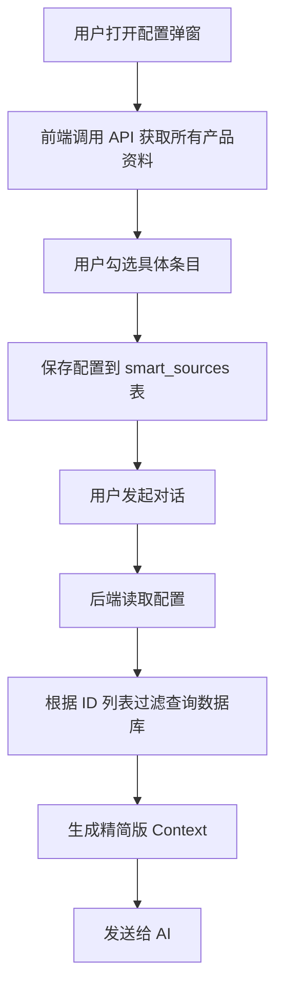

# 智能资料助手：产品规划资料联动功能规划 (V3.0 细粒度引用版)

## 1. 背景与目标
用户希望在“智能资料助手”中直接利用“产品规划”板块已有的结构化资料，且要求：
1.  **实时更新**：避免手动同步带来的数据滞后。
2.  **细粒度选择**：不仅仅是选择“卖点”这个模块，而是能具体勾选“卖点1”、“卖点3”，排除“卖点2”。

## 2. 核心功能
在 `SourceManager`（来源管理）组件中，新增 **“关联产品资料”** 功能，支持**树状结构**的细粒度勾选。

### 2.1 资料源层级结构
支持的层级结构如下：
*   **产品基础信息** (Product Info)
    *   名称/Slogan/定位 (默认全选，不可拆分)
*   **核心卖点** (Selling Points)
    *   [ ] 卖点 1：智能续写
    *   [x] 卖点 2：多风格切换
    *   [x] 卖点 3：实时协作
*   **功能特性** (Features)
    *   [x] 功能 A：用户管理
    *   [ ] 功能 B：支付系统
*   **用户画像** (Personas)
    *   [x] 画像 1：内容创作者
    *   [ ] 画像 2：企业管理员

### 2.2 交互设计
1.  **入口**：
    *   点击“关联产品资料”按钮。
2.  **配置弹窗 (Modal)**：
    *   展示一个树形选择器 (Tree Selector)。
    *   第一级：模块名称（如“核心卖点”）。
    *   第二级：具体的条目（如“智能续写”）。
    *   支持“全选/反选”。
    *   **实时预览**：鼠标悬停在条目上时，右侧显示该条目的具体内容（如卖点的详细描述），方便用户决策。
3.  **来源列表展示**：
    *   每个已关联的模块作为一个单独的来源项（如果选了多个模块，可以折叠展示，或者合并显示为“产品资料 (已选 5 项)”）。
    *   点击来源项的“设置”图标，可以重新打开弹窗调整勾选。

## 3. 技术实现方案

### 3.1 数据结构变更 (`smart_sources`)
*   `file_type`: `'live_product_data'`
*   `content`: 存储**引用配置** (Reference Configuration)，而非实际内容。
    ```json
    {
      "modules": {
        "selling_points": ["id_sp_1", "id_sp_3"], // 只引用这两个卖点 ID
        "features": ["all"], // 引用所有功能
        "personas": [] // 不引用画像
      }
    }
    ```

### 3.2 后端逻辑 (`api/smart/generate`)
1.  **读取配置**：解析 `content` 中的 JSON 配置。
2.  **精准查询**：
    *   如果配置是 `["all"]`，则查询该产品下的所有记录。
    *   如果配置是 `["id_1", "id_2"]`，则使用 `WHERE id IN (...)` 进行过滤查询。
3.  **动态组装**：只将用户勾选的那些条目拼接成 Markdown。

### 3.3 流程图


## 4. 开发计划
1.  **后端**：
    *   修改 `generate` 接口，支持解析 `modules` 配置并进行过滤查询。
2.  **前端**：
    *   新增 `ProductDataSelector` 组件（树状选择器）。
    *   改造 `SourceManager`，支持存储和编辑 JSON 格式的配置信息。
3.  **联调**：
    *   测试“勾选部分卖点”场景，确认 AI 只知道被勾选的卖点，不知道未勾选的卖点。
